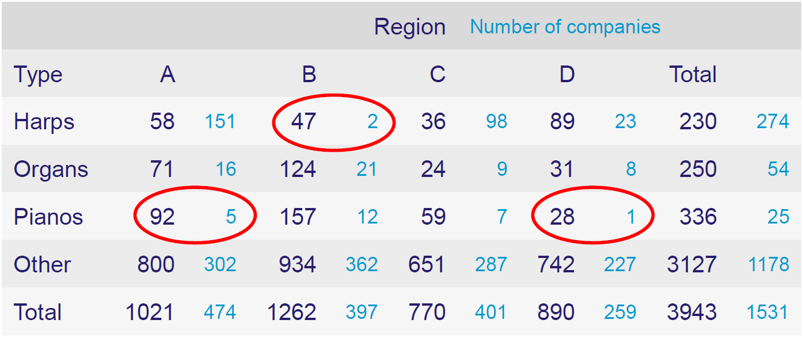
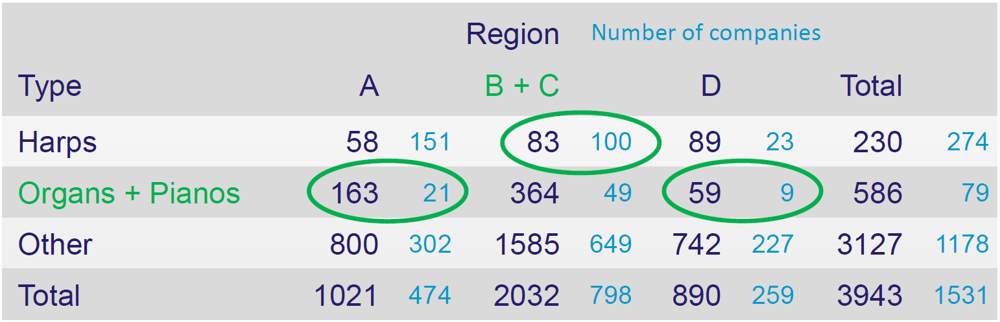

```{r include=FALSE}
library(knitr)
knitr::opts_chunk$set(echo = FALSE)
```

# Introduction

This notebook is dedicated to non-perturbation methods. We will start with the basics and then move to more advanced methods. 

Non-perturbation masking are methods that alter data to hide identities without changing its actual value. It does not rely on distortion of the original data but on partial suppressions or reductions of detail.

This includes methods such as: **Sampling**, **Global recoding**, **Top and bottom coding**, **Local suppression**, **Table redesign**.

# Little bit of methodology

## Methods

* **Sampling** - Selecting a subset of the data to be released.
* **Global recoding** - Re-categorisation applied to the data to reduce the level of detail.
  - Example: Employment size-classes 250-499, 500- 999 1000+ are merged into a single class, 250+
* **Top and bottom coding** - All values above or below a specified value are set to that value, or to a code indicating the class.
  - Example: All turnovers over €500 000 are set to equal €500 000 or to 500+.
* **Local suppression** - Suppressing individual cells in a table to prevent disclosure of sensitive information.
* **Table redesign** - Collapsing rows and/or columns of a table to reduce the level of detail in the data.

## Identification

We distinguish between *direct* and *indirect* identification of a statistical unit

* **direct identification** means identification on the basis of name, address or other identification number,
  - i.e. on the basis of any identifier that can be used without the need to spend disproportionate time and effort to establish the identity of the person in question
* **indirect identification** means identification in a way other than direct identification

Direct identification is prevented by removing variables containing this sensitive data. This is considered the **first step in the process of statistical dislosure methods**.

The effort is therefore to prevent **indirect identification**, which can occur, for example, by adding up the search values, or by using an external dataset or auxiliary information. 

We further may divide protection into **primary** and **secondary** confidentiality protection in case of *tabular* data, whose dissemination would permit attribute disclosure. 

* **Primary confidentiality** is the protection of the individual cells of the table. 
  - Refers to data whose aggregate value could allow for the identification of an individual unit.
  - There are two main reasons to declare data as primarily confidential:
    + **Too Few Units in a Cell**
      - If there are too few units in a cell, the data in that cell may be considered confidential.
      - A cell in a frequency table is defined as sensitive if the number of respondents is less than a specified number.
      -  Tested using the threshold rule (minimum number rule), which is based on the frequency of units in a cell.
      -  generaly, 3 and more units in a cell are considered safe.
    + **Dominance of One or Several Units in a Cell**
      - If one or a few units dominate a cell, the data in that cell may be considered confidential.
      - Tested using the (n,k) dominance rule or p%-rule.
      - Only make sense if the size of the variable is ‘identifying’! i.e., if ‘intruders’ know who the largest respondents are.
      - (n,k) dominance rule: A cell is unsafe, if the largest
*n* contributions in that cell amount to more than *k* % of the cell total.
      - For example, if n = 2 and k = 70, it means that the cell is defined as confidential if the two largest units contribute more than 70% to the total.
      - p%-rule: A cell is unsafe if some respondent to that cell can
estimate another respondent to that cell within p % of
its true value.
      - For example, if p = 5, it means that the cell is defined as confidential if the value of one unit can be estimated within 5% of its true value.    

  
* **Secondary confidentiality** is the protection of the table as a whole. 
    + This is important because it can be used to identify individuals by combining information from different cells.
    + Refers to table data that is not primarily confidential, but whose value, in combination with other data, allows for the identification of primarily protected units.
    + The most common method is **cell suppression**.
      - The goal is to prevent the disclosure of sensitive information by suppressing certain cells in the table.
      - The suppression of a cell means that the value of the cell is not published in the table.

### Secondary confidentiality example 

Illustrative example table representing Dividends paid by large national company 

| **Sex/Age** | **0-30** | **31-50** | **51-65** | **66-80** | **81+** | **Total** |
|---|---|---|---|---|---|---|
| **Males** | <span style="color:green">2</span> | <span style="color:green">170</span> | 400 | 930 | <span style="color:red">70</span> | 1572 |
| **Females** | <span style="color:red">8</span> | <span style="color:green">350</span> | 179 | 621 | <span style="color:orange">300</span> | 1458 |
| **Total** | 10 | 520 | 579 | 1551 | 370 | 3030 |

<span style="color:red"> Red - primary protection because in the given the group suppose it has only one such recipient of dividends.</span>

<span style="color:orange"> Orange - primary protection because share
of the largest recipient of dividends exceeds 70%</span>

Primary protection (for example suppression) is not enough, the data can be added. E.g. dividends of women over 80: 1572 – (930+400+170+2)

<span style="color:green">Green shading – secondary protection, additionally suppressed aggregates so that the primary protected cannot be estimated with great accuracy.</span>

## Variables

It is important to distinguish different types of variables: **direct identifiers**, **indirect identifiers** and **key variables**

**Direct identifiers**
  – such as name or unique identification number.
  – always removed from the microdata files, as they are clearly disclosive.
  
**Indirect identifiers**
  – such as NACE category, size class or region – which divide the total population into subpopulations; 
  – may be disclosive in combination with other variables.
  – The variables most likely to lead to identification are called *quasi-identifiers*.

**Key variables**
  – represent the criterion by which the confidentiality flag is set for variables. 
  – This variables must be protected.

## Important!
**<font size="4"><span style="color:red">Confidentiality protection always precedes dissemination</span> when deciding whether to release potentially confidential information.</font>**

# Let's try it out!

## Table redesign

**Task:** Combine rows and/or columns to increase the number of units that fall into cells.

```{r}
# Data with number of products
df_prod <- data.frame(
  row.names = c('Harps', 'Organs', 'Pianos', 'Other', 'Total'),
  A = c(58, 71, 92, 800, 1021),
  B = c(47, 124, 157, 934, 1262),
  C = c(36, 24, 59, 651, 770),
  D = c(89, 31, 28, 742, 890),
  Total = c(230, 250, 336, 3127, 3943)
)
df_prod

# Data with number of companies
df_comp <- data.frame(
  row.names = c('Harps', 'Organs', 'Pianos', 'Other', 'Total'),
  A = c(151, 16, 5, 302, 474),
  B = c(2, 21, 12, 362, 397),
  C = c(98, 9, 7, 287, 401),
  D = c(23, 8, 1, 227, 259),
  Total = c(274, 54, 25, 1178, 1531)
)
df_comp
```



<br>
**Solution** 
```{r}
To protect the data we need to join the regions B and C into one region. And Organs and Pianos into one category.
```

<div style="text-align: right;">
  <button id="toggleButton">Show/Hide</button>
</div>
<div id="imageContainer" style="display:none;">
  
</div>

<script>
document.getElementById("toggleButton").onclick = function() {
  var imgContainer = document.getElementById("imageContainer");
  if (imgContainer.style.display === "none") {
    imgContainer.style.display = "block";
  } else {
    imgContainer.style.display = "none";
  }};
</script>

```{r}
df_prod$"B+C" <- df_prod$B + df_prod$C
df_prod["Organs + Pianos",] <- df_prod["Organs",] + df_prod["Pianos",]
df_prod <- df_prod[,c(-2,-3)]
df_prod <- df_prod[,c(1,4,2,3)]
df_prod <- df_prod[c(-2,-3),]
df_prod <- df_prod[c(1,4,2,3),]
df_prod

df_comp$"B+C" <- df_comp$B + df_comp$C
df_comp["Organs + Pianos",] <- df_comp["Organs",] + df_comp["Pianos",]
df_comp <- df_comp[,c(-2,-3)]
df_comp <- df_comp[,c(1,4,2,3)]
df_comp <- df_comp[c(-2,-3),]
df_comp <- df_comp[c(1,4,2,3),]
df_comp
```


## Main library

We will use functions from the packafe *sdcMicro*

```{r}
library(sdcMicro)
```

## Data
We will use the SILC data (Statistics on Income and Living Conditions) from Austria.
This is a synthetic data set based on Austrian EU-SILC data from 2006.
The data set consists of 6 000 households. 

```{r}
library(laeken)
data(eusilc)
```

Let's have a look at the data.
```{r}
head(eusilc)
```

Only a few of the large number of variables in the original survey are included in this example data set. The variable names are rather cryptic codes, but these are the standardized names used by the statistical agencies. Furthermore, the variables hsize, age, eqSS and eqIncome are not included in the standardized format of EU-SILC data, but have been derived from other variables for convenience.

### Variables
We have a data frame with 14 827 observations on the following 28 variables:

- **db030** integer; the household ID. 
- **hsize** integer; the number of persons in the household. 
- **db040** factor; the federal state in which the household is located (levels Burgenland, Carinthia, Lower Austria, Salzburg, Styria, Tyrol, Upper Austria, Vienna and Vorarlberg). 
- **rb030** integer; the personal ID. age integer; the person’s age. 
- **rb090** factor; the person’s gender (levels male and female). 
- **pl030** factor; the person’s economic status (levels 1 = working full time, 2 = working part time, 3 = unemployed, 4 = pupil, student, further training or unpaid work experience or in compulsory military or community service, 5 = in retirement or early retirement or has given up business, 6 =permanently disabled or/and unfit to work or other inactive person, 7 = fulfilling domestic tasks and care responsibilities). 
- **pb220a** factor; the person’s citizenship (levels AT, EU and Other). 
- **py010n** numeric; employee cash or near cash income (net). 
- **py050n** numeric; cash benefits or losses from self-employment (net). 
- **py090n** numeric; unemployment benefits (net). 
- **py100n** numeric; old-age benefits (net). 
- **py110n** numeric; survivor’s benefits (net). 
- **py120n** numeric; sickness benefits (net). 
- **py130n** numeric; disability benefits (net). 
- **py140n** numeric; education-related allowances (net). 
- **hy040n** numeric; income from rental of a property or land (net). 
- **hy050n** numeric; family/children related allowances (net). 
- **hy070n** numeric; housing allowances (net). 
- **hy080n** numeric; regular inter-household cash transfer received (net). 
- **hy090n** numeric; interest, dividends, profit from capital investments in unincorporated business (net). 
- **hy110n** numeric; income received by people aged under 16 (net). 
- **hy130n** numeric; regular inter-household cash transfer paid (net). 
- **hy145n** numeric; repayments/receipts for tax adjustment (net). 
- **eqSS** numeric; the equivalized household size according to the modified OECD scale. 
- **eqIncome** numeric; a slightly simplified version of the equivalized household income. 
- **db090** numeric; the household sample weights. 
- **rb050** numeric; the personal sample weights.

## Create *sdcMicro* object
objSDC <- createSdcObj(dat = subData, 
                       keyVars = selectedKeyVars, 
                       weightVar = selectedWeights)

