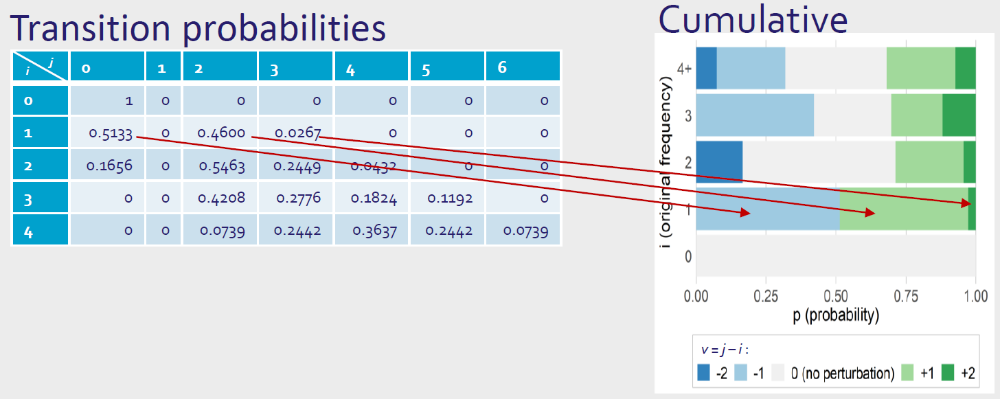
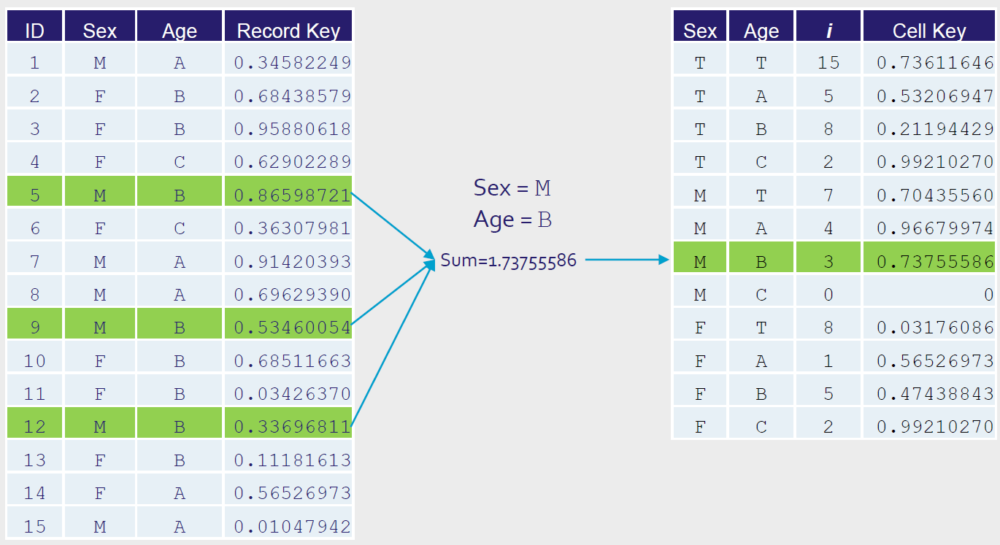
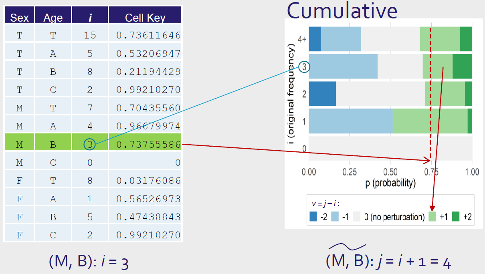

# Introduction

This notebook is dedicated to perturbation methods. We will start with the basics and then move to more advanced methods. 

Perturbation masking are methods that add noise or alter data values to prevent
identification.

This aproach includes methods such as: **Noise masking**, **Microaggreagtion**, **Record swapping**, **Rounding**, **Resampling**, **PRAM**.

# Little bit of methodology

## Methods

* **Noise masking** - Add random noise to cell values.
* **Microaggreagtion** - Records are grouped, based on a proximity measure of variables of interest, and the same small groups of records are used in calculating aggregates for those variables. Released is the aggregates (e.g. the mean of the aggregated values), not the individual record values.
* **Record swappin** - Swapping pairs of records that are partially matched on a set of key variables but are e.g. in different geographical locations.
* **Rounding** - Round each cell value to a pre-specified rounding base
* **Resampling** - Replace original values with resampled values.
* **PRAM** - (=Post Randomisation Method) The scores of a categorical variable are changed, with certain probabilities, into other scores.

## Methods for EU census data protection

European Census  represent an essential source of vital statistical information ranging from the lowest small area geographical divisions to national and international levels.

Harmonised census tables of 32 European countries are
available via the [Census Hub](https://ec.europa.eu/).

Raw census data are very sensitive, detailed, and confidential. The statistical offices are responsible for protecting them, and it's one of the most important tasks of census data processing.

**Restrictions**:

- No global recodes, the redesign of tables is not allowed (lay out of hypercubes fixed in implementing census regulation).
- No cell suppressions (very difficult for linked hypercubes and otherwise no European total can be calculated)

**Complications**:

- 1 $km^{2}$ grid cells lead to many small cell values
- 1 $km^{2}$ grid cells <=> administrative regions (risk of
disclosure due to differencing)

Flexible methods that could be adapted to national needs by statistical offices:

- *Pre tabular* method of **Target record swapping**
- *Post tabular* method of **Cell key method**

### Target record swapping

Pre-tabular method (changes in microdata).
Targeted Record Swapping -> target “high risk” households

Preparation: 

- Specify variables that define risk (k-anonymity) - *risk variables*
- Specify variables that define regional hierarchy - *Geographic hierarchy (NUTS1, NUTS2, NUTS3,…)*
- Calculate risk for all households at each regional level
- Specify variables that define “similar” households - *similarity variables*
- Specify minimum swap rate *p%*

“Similarity” variables

- Variables on which the swapped households must
agree on
-  for instance: household size, household type, …

Go from highest regional level to lowest:

- Make donor set of households
- “Similar” households of the high risk households
- Draw a donor household for a high risk household
- Same regional level , different region
- Swap all regional variables
- If minimum swap rate is not reached, swap
additional households at lowest regional level

Process:

1. Calculate total number of swaps given swap rate *p%*
2. Estimate risk *r~i,h~* through k-anonymity rule for each individual *i* in geographic hierarchy *h* using risk variables *v~1~,...,v~p~* with individual *i* living in area *g~1~* and *N~g1~* as the number of persons in *g~1~*

\[ r_{i,h} = \left( \sum_{j=1}^{N_{g1}} 1 \left[ v_{1(i)} = v_{1(j)} \land \ldots \land v_{p(i)} = v_{p(j)} \right] \right)^{-1} \]

\[ r_{i,h} \sim \frac{1}{\text{counts}} \]

3. Risk of household *y,R~y,h~*, is then defined by the maximum of risk across all household member
\[ R_{y,h} = \max_{i \text{ in household } y} \left( r_{i,h} \right) \]

4. Determine “high risk” households which will definitely be swapped in each hierarchy
5. Go through the geographic hierarchies (from top to bottom)
6. In each geographic area sample households by probability (~risk) and swap them
7. At lowest hierarchy distribute number of swaps left to reach swap rate *p%*
  - distributed proportional to cumulative risk
  - swap rate only lower bound on number of swaps

### Cell key method

Post tabular method (noise added to table cells).

Introduces another layer of uncertainty for intruder. Cell key method is primarily used for protecting against differencing attacks.

Process:

1. Determine **p-table**
    - p-table represent transition probabilities
    - p~ij~ = P(cell value *i* is changed into value *j*)
    - calculated by package [ptable](https://cran.r-project.org/web/packages/ptable/index.html)

    
2. Draw 𝒰(0,1) value for each record = *record key*
3. Sum record keys of records in each table cell
4. Assign fractional part of that sum as **cell key** to each
table cell

5. Use **cell value** AND **cell key** AND **p-table** to get amount of noise to add to that cell

